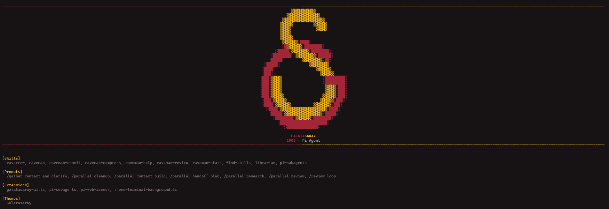

# Galatasaray Theme for Pi Agent

Unofficial Galatasaray-inspired theme and startup interface for [Pi Agent](https://github.com/earendil-works/pi-mono).



## Features

- Galatasaray-inspired red and yellow color palette
- Responsive full, compact, and text-only startup branding
- Custom block-art startup logo
- Custom startup header, working indicator, and status badge
- Smart GS status with active model and thinking level
- Live and final request elapsed time in the responsive status panel
- Light-yellow-to-deep-red context usage progress bar

## Installation

Install the theme and extension directly from GitHub:

```bash
pi install git:github.com/serhattemel/pi-galatasaray-theme
```

Then open `/settings`, select **Galatasaray**, and run `/reload` or restart Pi.

### Manual installation

Alternatively, copy the files into your global Pi configuration directory:

```text
themes/galatasaray.json       -> ~/.pi/agent/themes/galatasaray.json
extensions/galatasaray-ui.ts  -> ~/.pi/agent/extensions/galatasaray-ui.ts
```

On Windows, `~` normally corresponds to `C:\Users\<username>`.

Then start Pi, select **Galatasaray** from `/settings`, and run `/reload`.

## Update

```bash
pi update --extensions
```

## Uninstall

```bash
pi remove git:github.com/serhattemel/pi-galatasaray-theme
```

For a manual installation, delete these files and restart Pi:

```text
~/.pi/agent/themes/galatasaray.json
~/.pi/agent/extensions/galatasaray-ui.ts
```

## Disclaimer

This is an unofficial fan-made project. It is not affiliated with, endorsed by, or sponsored by Galatasaray Spor Kulübü.
